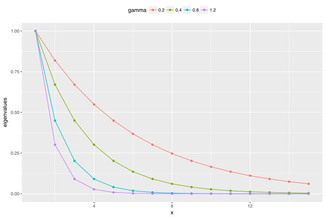
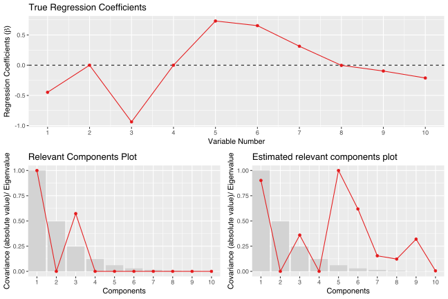
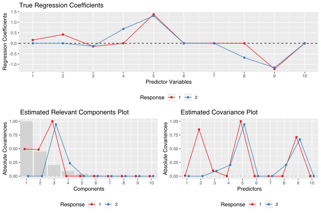
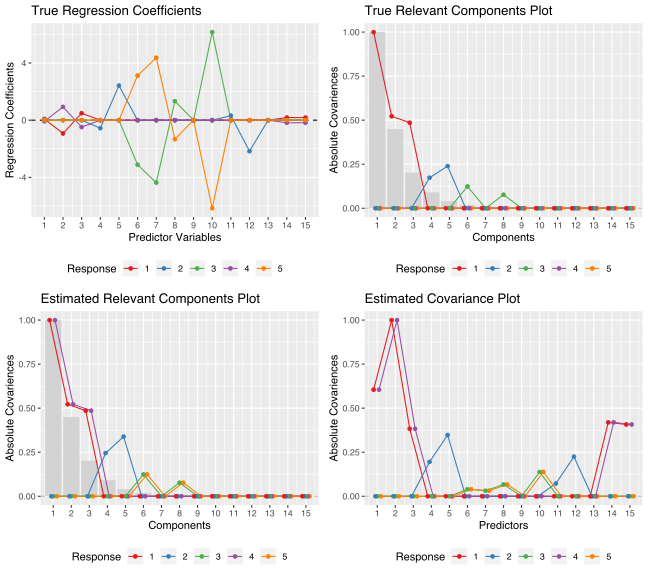
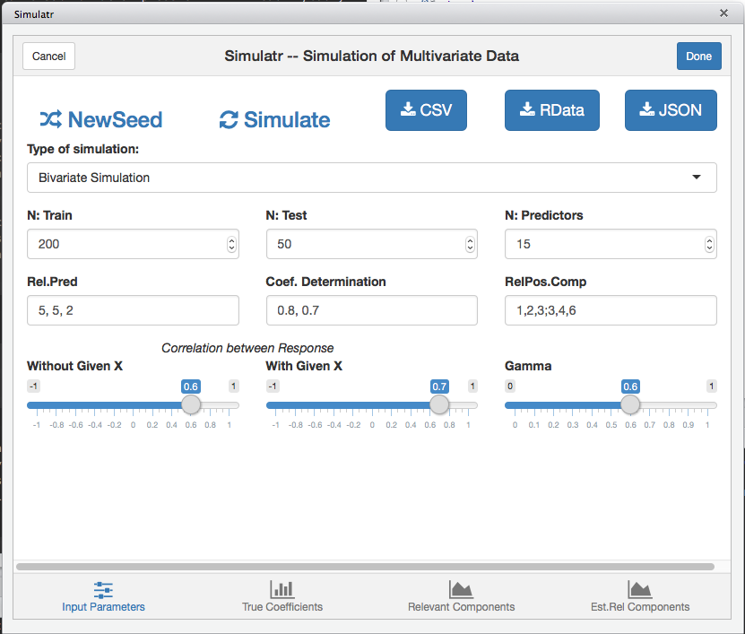

Simulation of Multivariate Linear Model Data
================
Raju Rimal, Trygve Almøy & Solve Sæbø

[](https://travis-ci.org/simulatr/simrel)
[](https://codecov.io/gh/simulatr/simrel?branch=master)

# Introduction

`Simrel` r-package is a versatile tool for simulation of multivariate
linear model data. The package consist of four core functions –
`unisimrel`, `bisimrel`, `multisimrel` and `simrel` for simulation. It
also has two more functions – one for plotting covariance and rotation
matrices and another for plotting different properties of simulated
data. As the name suggests, `unisimrel` function is used for simulating
univariate linear model data, `bisimrel` simulates bivariate linear
model data where user can specify the correlation between two responses
with and without given **X**. In addition, this function allows users to
get responses (**y**) having common relevant components.

An extension of `bisimrel` and `unisimrel` is `multisimrel`, by which
user can simulate multivariate linear model data with multiple
responses. In this simulation, each response must have exclusive set of
predictors and relevant predictors components. Following examples will
give a clear picture of these functions. The forth simulation function
`simrel` wraps around these function and calls them according to what
type of data a user is simulating. Following section discusses about the
arguments required for each of these simulation function.

## Simulation Parameters

A tool for simulating linear model data with single response discussed
in sæbø et.al. (2015) and multi-response discussed in rimal et.al.
(2018) is the basis for these functions. The function require following
arguments which are also parameters for the simulation.

<details>

<summary><code>n</code>: Number of training samples (n)</summary> An
integer for number of training samples. For example: <code>n =
1000</code> simulates 1000 training observations.

</details>

<details>

<summary><code>p:</code> Number of predictor variables (p)</summary> An
integer for number of predictor variables. <code>p = 150</code> gives
data with 150 predictor variables.

</details>

<details>

<summary><code>q:</code> Number of relevant predictors (q)</summary> An
integer for the number of predictor variables that are relevant for the
response. For example: <code>q = 15</code> results 15 predictors out of
<code>p</code> relevant for the response.

</details>

<details>

<summary><code>relpos:</code> Position of relevant components</summary>
A vector of position index of relevant principal components of
<strong>x</strong>. For instance, <code>relpos = c(1, 2, 3, 5)</code>
will give data with 4 relevant components at position 1, 2, 3 and 5.

</details>

<details>

<summary><code>R2:</code> Coefficient of determination</summary> A
decimal value between 0 and 1 specifying the coefficient of
determination. Input of <code>R2 = 0.8</code> gives data with 0.8
coefficient of determination.

</details>

<details>

<summary><code>gamma:</code> Decay factor for exponential decay of
eigenvalues of predictor variables</summary> A numeric value greater
than 0. It is a factor controlling exponential decay of eigenvalues of
predictor variables. For <code>p</code> predictors, the eigenvalues are
computed as <code>exp(-gamma(i-1))</code> for <code>i=1, 2, …, p</code>
so that, higher the value of <code>gamma</code> steeper will be the
decay of eigenvalues. Since steeper eigenvalues corresponds to high
multicollinearity in data, <code>gamma</code> also controls the
multicollinearity present in the simulated data.



</details>

<details>

<summary><code>m:</code>Number of Response Variables (Only applicable
for Univariate Simulation)</summary> An integer specifying the number of
response variables to simulate. This is only applicable in Multivariate
Simulation (<code>multisimrel</code>).

</details>

<details>

<summary><code>eta:</code>Position of response components indices to
combine together</summary> The true dimension of response matrix
containing the information can be smaller than the dimension that is
defined by all the response variables. Lets suppose for an example that
only two response components actually contains information that the
predictor (or a subset of predictor) can explain. However, In the
simulation data user might want 5 response variables that contains the
same inforamtion contained in two latent component of the respone
variables. The <code>eta</code> parameters if specified as
<code>list(c(1, 3), c(2, 4, 5))</code> will mix up the inforamtion in
response component 1 with uninformative component 3 so that the response
variable 1 and 3 contains the same information that was contained in
response component 1. A similar description can be made for the second
response component which is mixed with non-informative response
components 4 and 5.

</details>

<details>

<summary><code>rho:</code>Correlation between two response variables
(Only applicable for Bivariate Simulation</summary> A vector of two
numbers specifying the correlation between the the two response variable
in bivariate simulation. The first number is for the correlation without
the knownledge of predictors while the second number is for the
correlation given the predictors. These values should be between the
range of a correlation, i.e. -1 to 1.

</details>

| Parameters | Descriptions                                                        |
| ---------- | ------------------------------------------------------------------- |
| `n`        | Number of training samples                                          |
| `p`        | Number of predictor variables                                       |
| `q`        | Number of relevant predictors                                       |
| `relpos`   | Position of relevant components                                     |
| `R2`       | Coefficient of determinations                                       |
| `rho`      | Correlation between two responses (only applicable on `simrel2`)    |
| `gamma`    | Decaying factor of eigenvalues of predictor matrix                  |
| `m`        | Number of required response vector (only applicable for `simrel_m`) |

# Installation

Install the package from GitHub,

``` r
# install.pacakges("devtools")
devtools::install_github("simulatr/simrel")
devtools::install_bitbucket("simulatr/simrel")
```

# Examples

## Univariate Simulation:

Simulate a univariate linear model data with 100 training samples and
500 test samples having 10 predictors (**X**) where only 8 of them are
relevant for the variation in the response vector. The population model
should explain 80% of the variation present in the response. In
addition, only 1st and 3rd principal components of **X** should be
relevant for *y* and the eigenvalues of **X** decreases exponentially by
a factor of 0.7.

``` r
library(simrel)
sim_obj <-
  simrel(
    n      = 100,         # 100 training samples
    p      = 10,          # 10 predictor variables
    q      = 8,           # only 8 of them are relevant
    R2     = 0.8,         # 80% of variation is explained by the model
    relpos = c(1, 3),     # First and third principal components are relevant
    gamma  = 0.7,         # decay factor of eigenvalue of X is 7
    ntest  = 500,         # 500 Test observations
    type   = "univariate" # Univariate linear model data simulation
)
```

Here `sim_obj` is a object with class `simrel` and constitue of a list
of simulated linear model data along with other relevant properties.
Lets use `plot` function to overview the situation,

``` r
plot_simrel(sim_obj, which = c(1, 2, 4),
            layout = matrix(c(1, 1, 2, 3), 2, 2, byrow = TRUE))
```



## Bivariate Simulation

The wrapper function `simrel` uses `bisimrel` for simulating bivariate
linear model data. Lets consider a situation to simulate data from
bivariate distribution with 100 training and 500 test samples. The
response vectors **y**<sub>1</sub> and **y**<sub>2</sub> have
correlation of 0.8 without given **X** and 0.6 with given **X**. Among
10 total predictor variables, 5 are relevant for **y**<sub>1</sub> and 5
are relevant for **y**<sub>2</sub>. However 3 of them are relevant for
both of them. Let the predictors explain 80% and 70% of total variation
present in population of **y**<sub>1</sub> and **y**<sub>2</sub>
respectively. In addition, let 1, 2 and 3 components are relevant for
**y**<sub>1</sub> and 3 and 4 components are relevant for
**y**<sub>2</sub>. In this case, the third component is relevant for
both responses. Let the decay factor of eigenvalues of **X** be 0.8.

``` r
simrel2_obj <-
  simrel(
    n      = 100,                       # 100 training samples
    p      = 10,                        # 10 predictor variables
    q      = c(5, 5, 3),                # relevant variables for y1 and y2
    relpos = list(c(1, 2, 3), c(3, 4)), # relevant components for y1 and y2
    R2     = c(0.8, 0.7),               # Coefficient of variation for y1 and y2
    rho    = c(0.8, 0.6),               # correlation between y1 and y2 with and without given X
    gamma  = 0.8,                       # decay factor of eigenvalues of X
    ntest  = 500,                       # 500 test samples
    type   = "bivariate"
  )
```

Lets look at the plot,

``` r
plot_simrel(simrel2_obj, which = c(1, 3, 4),
            layout = matrix(c(1, 1, 2, 3), 2, 2, byrow = TRUE))
```



## Multivariate Simulation

Multivariate simulation uses `multisimrel` function and can simulate
multiple responses. Lets simulate 100 training samples and 500 test
samples. The simulated data has 5 responses and 15 predictors. These 5
responses spans 5 latent space out of which only 3 are related to the
predictors. Lets denote them by **w**<sub>i</sub>. Let 5, 4 and 4
predictors are relevant for response components **w**<sub>1</sub>,
**w**<sub>1</sub> and **w**<sub>1</sub> respectively. The position of
relevant predictor components for **w**<sub>1</sub> be 1, 2, 3; for
**w**<sub>2</sub> be 4 and 5. Similarly, predictor components 6 and 8
are relevant for **w**<sub>3</sub>.

Since we need 5 response variables, we mix-up these 3 informative
response components with 2 remaining uninformative components so that
all simulated response contains information that **X** are related. Lets
combine **w**<sub>1</sub> with **w**<sub>4</sub> and **w**<sub>3</sub>
with **w**<sub>5</sub>. So that the predictors that are relevant for
response components **w**<sub>1</sub> will be relevant for response
**y**<sub>1</sub> and **y**<sub>3</sub> and so on.

In addition to these latent space requirements, let **X** explains 80%
variation present in **w**<sub>1</sub>, 50% in **w**<sub>2</sub> and 70%
in **w**<sub>3</sub>. The eigenvalues of X reduces by the factor of 0.8.

``` r
simrel_m_obj <-
simrel(
    n      = 100,                                # 100 training samples
    p      = 15,                                 # 15 predictor variables
    q      = c(5, 4, 4),                         # relevant variables for w1, w2 and w3
    relpos = list(c(1, 2, 3), c(4, 5), c(6, 8)), # relevant components for w1, w2 and y3
    R2     = c(0.8, 0.5, 0.7),                   # Coefficient of variation for w1, w2 and y3
    ypos   = list(c(1, 4), c(2), c(3, 5)),       # combining response components together
    m      = 5,                                  # Number of response
    gamma  = 0.8,                                # decay factor of eigenvalues of X
    ntest  = 500,                                # 500 test samples
    type   = "multivariate"                      # multivariate simulation
  )
```

Lets look at the `simrel` plot;

``` r
plot_simrel(simrel_m_obj, which = 1:4,
            layout = matrix(1:4, 2, 2, byrow = TRUE))
```



## RStudio Addins

To make the process easier to use, we have created a shiny gadget as an
rstudio addons. If you are using Rstuio, you can access this app from
Tools \> Addins \> simulatr. But you can also access this app using
`simrel::app_simulatr()`. This will open the app in a browser from where
you can choose all your parameter, see the true population parametrs you
will get from the simulation. When the app is closed, it will give an
command output on your R console.



## References

  - Sæbø, S., Almøy, T., & Helland, I. S. (2015). simrel—A versatile
    tool for linear model data simulation based on the concept of a
    relevant subspace and relevant predictors. <em>Chemometrics and
    Intelligent Laboratory Systems</em>, 146, 128-135.
  - Rimal, R., Almøy, T., & Sæbø, S. (2018). A tool for simulating
    multi-response linear model data. <em>Chemometrics and Intelligent
    Laboratory Systems</em>, 176, 1-10.
