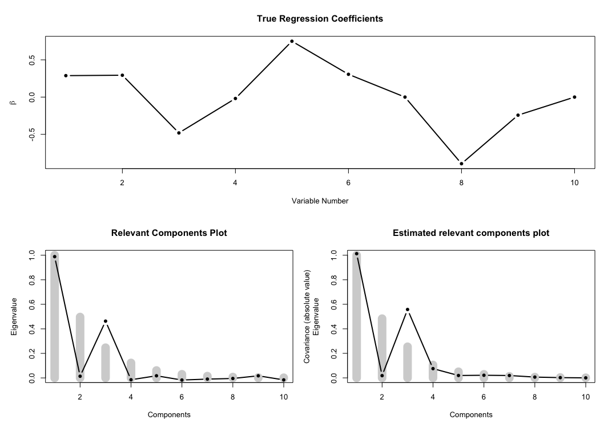

Simulation of Multivariate Linear Model Data
================
Raju Rimal & Solve Sæbø

[](https://travis-ci.com/therimalaya/simulatr) [](https://codecov.io/gh/therimalaya/simulatr)

Introduction
============

`Simrel` r-package is a versatile tool for simulation of multivariate linear model data. The package consist of four core functions -- `simrel`, `simrel2`, `simrel_m` and `simulatr` for simulation and a plot function `plot.simulatr`. As the name suggests, `simrel` function is used for simulating univariate linear model data, `simrel2` simulates bivariate linear model data where user can specify the correlation between two responses with and without given **X**. In addition, this function allows users to get responses (**y**) having common relevant components.

An extension of `simrel2` is `simrel_m`, by which user can simulate multivariate linear model data with multiple responses. In this simulation, each response must have exclusive set of predictors and relevant predictors components. Following examples will give a clear picture of these functions. The forth function `simulatr` wraps around these function and calls them according to what type of data a user is simulating.

Following parameters (arguments) are used in these function,

| Parameters | Descriptions                                                        |
|------------|---------------------------------------------------------------------|
| `n`        | Number of training samples                                          |
| `p`        | Number of predictor variables                                       |
| `q`        | Number of relevant predictors                                       |
| `relpos`   | Position of relevant components                                     |
| `R2`       | Coefficient of determinations                                       |
| `rho`      | Correlation between two responses (only applicable on `simrel2`)    |
| `gamma`    | Decaying factor of eigenvalues of predictor matrix                  |
| `m`        | Number of required response vector (only applicable for `simrel_m`) |

Installation
============

Install the package from GitHub,

``` r
# install.pacakges("devtools")
devtools::install_github("therimalaya/simulatr")
```

Examples
========

Univariate Simulation:
----------------------

Simulate a univariate linear model data with 100 training samples and 500 test samples having 10 predictors (**X**) where only 8 of them are relevant for the variation in the response vector. The population model should explain 80% of the variation present in the response. In addition, only 1st and 3rd principal components of **X** should be relevant for *y* and the eigenvalues of **X** decreases exponentially by a factor of 0.7.

``` r
library(simulatr)
sim_obj <- 
  simulatr(
    n      = 100,         # 100 training samples
    p      = 10,          # 10 predictor variables
    q      = 8,           # only 8 of them are relevant
    R2     = 0.8,         # 80% of variation is explained by the model
    relpos = c(1, 3),     # First and third principal components are relevant
    gamma  = 0.7,         # decay factor of eigenvalue of X is 7
    ntest  = 500,         # 500 Test observations
    type   = "univariate" # Univariate linear model data simulation
)
```

Here `sim_obj` is a object with class `simrel` and constitue of a list of simulated linear model data along with other relevant properties. Lets use `plot.simulatr` function to overview the situation,

``` r
  png(filename = "figure/simrel-plot.png")
  plot_simulatr(sim_obj, ask = FALSE)
  dev.off()
```



Bivariate Simulation
--------------------

The wrapper function `simulatr` uses `simrel2` for simulating bivariate linear model data. Lets consider a situation to simulate data from bivariate distribution with 100 training and 500 test samples. The response vectors **y**<sub>1</sub> and **y**<sub>2</sub> have correlation of 0.8 without given **X** and 0.6 with given **X**. Among 10 total predictor variables, 5 are relevant for **y**<sub>1</sub> and 5 are relevant for **y**<sub>2</sub>. However 3 of them are relevant for both of them. Let the predictors explain 80% and 70% of total variation present in population of **y**<sub>1</sub> and **y**<sub>2</sub> respectively. In addition, let 1, 2 and 3 components are relevant for **y**<sub>1</sub> and 3 and 4 components are relevant for **y**<sub>2</sub>. In this case, the third component is relevant for both responses. Let the decay factor of eigenvalues of **X** be 0.8.

``` r
simrel2_obj <- 
  simulatr(
    n      = 100,                       # 100 training samples
    p      = 10,                        # 10 predictor variables
    q      = c(5, 5, 3),                # relevant variables for y1 and y2
    relpos = list(c(1, 2, 3), c(3, 4)), # relevant components for y1 and y2
    R2     = c(0.8, 0.7),               # Coefficient of variation for y1 and y2
    rho    = c(0.8, 0.6),               # correlation between y1 and y2 with and without given X
    gamma  = 0.8,                       # decay factor of eigenvalues of X
    ntest  = 500,                       # 500 test samples
    type   = "bivariate"
  )
```

Lets look at the plot,

``` r
  png(filename = "figure/simrel2-plot.png")
  plot_simulatr(simrel2_obj, ask = FALSE)
  dev.off()
```


