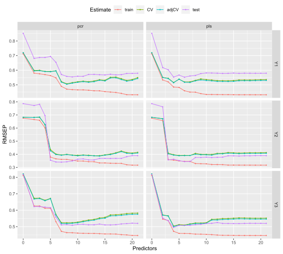
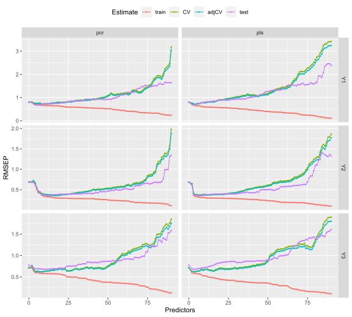

## Loading Packages

```r
library(simrel)
library(pls)
library(ggplot2)
```

## Setting up parameters list

```r
sim_list <- list(
    p = c(20, 150),
    gamma = seq(0.2, 1.1, length.out = 4),
    relpos = list(list(c(1, 2, 3), c(4, 5, 6)), list(c(1, 5, 6), c(2, 3, 4))),
    R2 = list(c(0.4, 0.8), c(0.8, 0.8)),
    ypos = list(list(1, c(2, 3)), list(c(1, 3), 2))
  )
```

`mbrdsim` function in simrel lets user to create a factorial fractional design from the parameter list. From the `sim_list` defined above, we have two levels of "number of variables (p)", four level of multicollineary level controlled by `gamma`. In addition, two levels of positions of relevant components and coefficient of determination are also defined. Further, we have set up two way to combine the response components. We have two informative dimension of response at first and second components. In one level, we combined the uninformative component three with first component and  in another level, we combine it with second component. The additional parameters for simulation are fixed as follows,

## Experimental Design


```r
design <- mbrdsim(sim_list, fraction = 3)[["Design"]]
  design <- cbind(
    design,
    q = lapply(design[, "p"], function(x) rep(x/2, 2)),
    type = "multivariate",
    n = 100,
    ntest = 200,
    m = 3,
    eta = 0.6
  )
```

From the simulation parameters in each row of `design` table, we run our simulation.

## Simulation


```r
sobj <- apply(design, 1, function(x) do.call(simrel, x))
  names(sobj) <- paste0("Design", seq.int(sobj))
```

Now we have eight datasets with distict properties as we have desired. We can now use these datasets in order to compare PCR and PLS estimation methods.

## Comparison of Estimation Methods

The estimation methods we have used here is PCR and PLS. Now we can fit each of our data using PCR and PLS method.


```r
fit <- list()
  fit$pcr <- lapply(sobj, function(obj) {
    dta <- data.frame(x = I(obj$X), y = I(obj$Y))
    pcr(y ~ x, data = dta, validation = "CV", segments = 10)
  })
  fit$pls <- lapply(sobj, function(obj) {
    dta <- data.frame(x = I(obj$X), y = I(obj$Y))
    plsr(y ~ x, data = dta, validation = "CV", segments = 10)
  })
```

### Calculating RMSEP
We base our comparison on the basis of root mean square error of prediction. We can calculate and compare both cross-validated and test error.


```r
rmsep <- lapply(fit, function(f){
    sapply(names(f), function(d){
      new_data <- with(sobj[[d]], data.frame(x = I(testX), y = I(testY)))
      out <- RMSEP(f[[d]], newdata = new_data, estimate = "all")
      reshape2::melt(out[["val"]])
    }, simplify = FALSE)
  })
```

## Plotting RMSEP

```r
get_error_plot <- function(dgn){
    df <- do.call(rbind, lapply(rmsep, "[[", dgn))
    df$method <- gsub("\\.[0-9]+", "", rownames(df))
    rownames(df) <- NULL
    df$model <- ifelse(df$model == "(Intercept)", "0", df$model)
    df$model <- as.numeric(gsub("[A-Za-z]+", "", df$model))
    ggplot(df, aes(model, value, color = estimate, group = estimate)) +
      geom_line() + geom_point(size = 0.5) +
      facet_grid(response ~ method, scales = "free_y") +
      theme(legend.position = "top") +
      labs(x = "Predictors", y = "RMSEP", color = "Estimate")
  }
```

The above function, can plot prediction error (RMSEP) from both estimation methods for all three response variables. Lets plot the error for first and second design,


```r
get_error_plot(1)
```



```r
get_error_plot(2)
```




